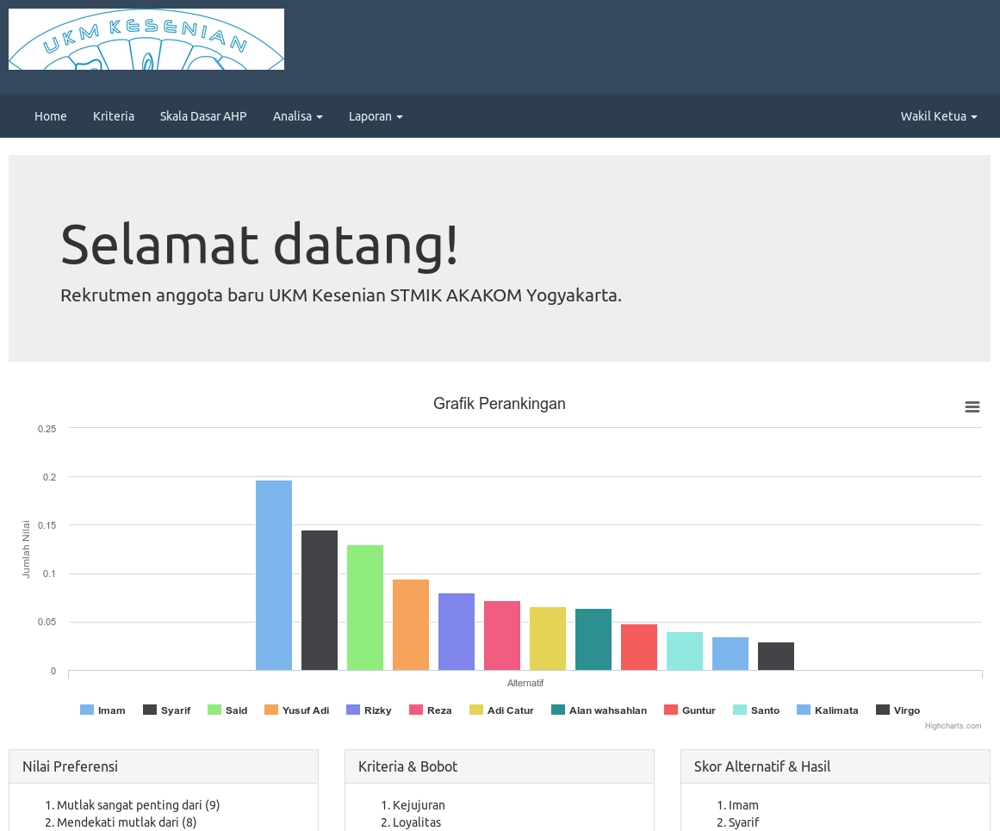

# DSS Rekrutmen anggota
[](https://github.com/imamdigmi/simple-recruitment-dss-ahp/blob/master/LICENSE)

Rekrutmen anggota baru UKM Kesenian STMIK AKAKOM Yogyakarta



## Cara menggunakan
1. Clone repository
  ```
  $ git clone https://github.com:imamdigmi/simple-recruitment-dss-ahp.git
  ```
2. Letakkan folder didalam root direktori web server
3. Import `database.sql`
4. Kunjungi [localhost/simple-recruitment-dss-ahp](http://localhost/simple-recruitment-dss-ahp)
5. Login
  - Operator
    - username : operator
    - password : operator
  - Wakil Ketua
    - username : wakil
    - password : wakil
  - Ketua Umum
    - username : ketua
    - password : ketua


## Cara melakukan perubahan
```
$ git add -A
$ git commit -m "pesan perubahan"
$ git push origin maser
$ git pull origin master
```
